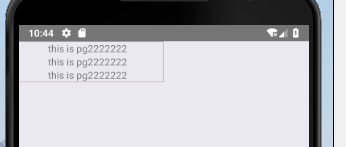
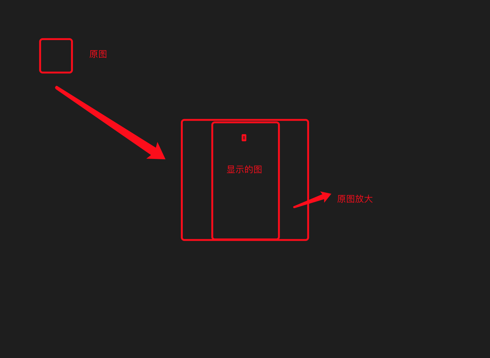
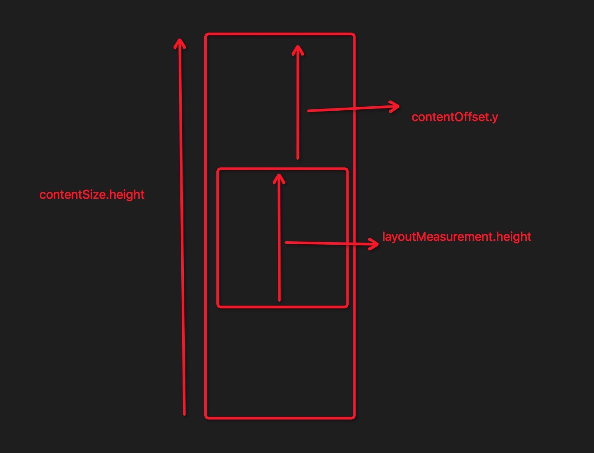

## RN的组件、事件与导航

### 一、组件
#### 1   View
```
作为创建 UI 时最基础的组件，View 是一个支持 Flexbox 布局、样式、一些触摸处理、和一些无障碍功能的容器，并且它可以放到其它的视图里，也可以有任意多个任意类型的子视图。不论在什么平台上，View 都会直接对应一个平台的原生视图，无论它是 UIView、还是 android.view.View。
```
以上是reactnative.cn对View的定义。在笔者看来，View的定位与div类似。但是与div相比，有以下一些不同。
#####  1.1 View 的box-sizing默认是border-box。

<br>

如上图所示，笔者给红框的View宽度设为屏幕宽度的一半，并在设置了一个不小的paddingLeft，最后渲染出来的宽度还是屏幕的一半。

##### 1.2 View默认布局是flex布局,且flex-direction默认方向是column。
RN 不支持float属性，传统的通过float定位实现的布局方法，在RN中是行不通的。RN中只能在flex的基础上，通过margin和padding属性来布局。

##### 1.3 View的默认overflow 属性是hidden。即超过View高度的内容将被隐藏。

如果没有给View设置高度,那么View的高度将会被子元素撑开，但是最大不会超过屏幕的高度。此时，超出的内容就会隐藏。

##### 1.5 View不能直接包裹一段文字。

在传统前端开发中，div可以包裹任何东西。但是在RN中，View组件不能包裹文字。必须在文字外包上一层Text组件或者其他可以包裹文字的组件。

##### 1.4 View的样式不会被子组件继承。
比如，给View设置的color、fontSize属性，不会被其子组件继承。深层原因是，View组件并不支持上述两个CSS属性。View支持的属性如下：<br/>

```
export interface ViewStyle extends FlexStyle, ShadowStyleIOS, TransformsStyle {
    backfaceVisibility?: "visible" | "hidden";
    backgroundColor?: string;
    borderBottomColor?: string;
    borderBottomEndRadius?: number;
    borderBottomLeftRadius?: number;
    borderBottomRightRadius?: number;
    borderBottomStartRadius?: number;
    borderBottomWidth?: number;
    borderColor?: string;
    borderEndColor?: string;
    borderLeftColor?: string;
    borderLeftWidth?: number;
    borderRadius?: number;
    borderRightColor?: string;
    borderRightWidth?: number;
    borderStartColor?: string;
    borderStyle?: "solid" | "dotted" | "dashed";
    borderTopColor?: string;
    borderTopEndRadius?: number;
    borderTopLeftRadius?: number;
    borderTopRightRadius?: number;
    borderTopStartRadius?: number;
    borderTopWidth?: number;
    borderWidth?: number;
    opacity?: number;
    testID?: string;
    /**
      * Sets the elevation of a view, using Android's underlying
      * [elevation API](https://developer.android.com/training/material/shadows-clipping.html#Elevation).
      * This adds a drop shadow to the item and affects z-order for overlapping views.
      * Only supported on Android 5.0+, has no effect on earlier versions.
      *
      * @platform android
      */
    elevation?: number;
}
```
Text 组件支持的属性如下：
```
export interface TextStyle extends TextStyleIOS, TextStyleAndroid, ViewStyle {
    color?: string;
    fontFamily?: string;
    fontSize?: number;
    fontStyle?: "normal" | "italic";
    /**
     * Specifies font weight. The values 'normal' and 'bold' are supported
     * for most fonts. Not all fonts have a variant for each of the numeric
     * values, in that case the closest one is chosen.
     */
    fontWeight?: "normal" | "bold" | "100" | "200" | "300" | "400" | "500" | "600" | "700" | "800" | "900";
    letterSpacing?: number;
    lineHeight?: number;
    textAlign?: "auto" | "left" | "right" | "center" | "justify";
    textDecorationLine?: "none" | "underline" | "line-through" | "underline line-through";
    textDecorationStyle?: "solid" | "double" | "dotted" | "dashed";
    textDecorationColor?: string;
    textShadowColor?: string;
    textShadowOffset?: { width: number; height: number };
    textShadowRadius?: number;
    testID?: string;
}
```
对于color/fontFamily之类的属性，View组件本身是不支持的，给它加上上述样式，并不会起任何作用(值得注意的是，Text组件的样式是可以继承的)。
#### 2 Text

```
一个用于显示文本的React组件，并且它也支持嵌套、样式，以及触摸处理。
```
以上是Text组件的官方定义。根据笔者的经验，Text组件相当于p+span标签。

Text标签默认占据一行。View标签下两个同级的Text标签会占据两行，表现与p标签类似。但是一个Text标签内的Text标签，并不会占据一行，表现为行内元素， 与span类似。同时，子Text标签会继承父Text标签的一些属性（interface TextStyle 中除了test ID外都会被继承）。

从TextStyle的定义可以看出，Text的样式继承了ViewStyle。最底层的Text标签表现与p标签类似，可以定义ViewStyle中的CSS属性，如magin,padidng相关的若干属性。但是Text组件的子Text组件，并不支持ViewStyle中定义的组件。因此，RN中无法给行内元素添加宽度、margin等属性，也没发依此来布局。

#### 3 Image

```
用于显示多种不同类型图片的 React 组件，包括网络图片、静态资源、临时的本地图片、以及本地磁盘上的图片（如相册）等。
```
Image组件的使用，有一些几点是需要注意的
##### 3.1  默认尺寸问题
对于网络和 base64 数据的图片，需要手动设定图片尺寸。如果不设置的化，图片将显示默认尺寸，就是0。本地图片不指定尺寸，将按照原图尺寸显示。

##### 3.2 缩放
在浏览器中，设置好图片尺寸后，如果设置尺寸比例与图片的比例不一致，图片会被缩放，最后显示的图片可能会变形。在RN中，图片两边缩放比例是一样的，不会变形，但是会被裁剪。比如，原图片尺寸为100*100，设置标签属性的宽度和高度分别为200*400.那么原图片会被方法成400*400。但是横行宽度是200，这200的宽度显示的是放大后图片中间200的部分。如下图所示：


#### 4 ScrollView
前面提到，View是不支持滚动的，超过其高度的内容会被隐藏。想要滑动显示内容，需要用到ScrollView。scrollView需要有确认的高度才能正确工作。一般给其父组件设置好确认高度，然后Scrollview会自动填充满父组件的高度。

ScrollView没有滚动到底部的callBack事件，可以在onScroll这个回调中根据滑动位置，来判断是否滑动到了底部。具体如下：
```
<ScrollView onScroll={(e)=>this.handleScroll(e)}>
    {/* element wraped by scroll view */}
</ScrollView>

handleScroll(e:NativeSyntheticEvent<NativeScrollEvent> | undefined){
    if(e){
        console.log(e.nativeEvent) //把e.nativeEvent打印出来看一下
    }
}
```
打印结果如下：<br>

```
// 因此，可以根据上图，简单得到下面的方法：
const offset = e.nativeEvent.contentOffset.y;
const scrollViewHeight = e.nativeEvent.layoutMeasurement.height;
const totalHeight = e.nativeEvent.contentSize.height;
if(offset+scrollViewHeight > totalHeight-300){  //根据实际情况取值
console.log(e.nativeEvent)
    this.store.loadRecommendations();
}
```